# Architecture and decisions

LeadLens is a bounded, dynamically navigating pipeline, not an unrestricted LLM planning agent.

```mermaid
flowchart LR
    A[CLI or async enrich API] --> B[Validate settings and normalize domains]
    B --> C[Bounded company workers]
    C --> D[Robots and destination policy]
    D --> E[Isolated Chromium context]
    E --> F[Discover and prioritize links]
    F --> E
    E --> G[Clean text and preserve contacts / profiles]
    G --> H[Diverse context within token budget]
    H --> I[OpenAI Responses structured parsing]
    I --> J[Grounding and at most one repair]
    J --> K[Optional Tavily candidates]
    K --> L[Heuristic score and usage]
    L --> M[Single writer / atomic JSON checkpoints]
```

| Module | Responsibility |
|---|---|
| `config`, `models`, `cli` | Validated limits, separate source/provider/final schemas, commands and exit codes |
| `urls`, `budget` | Normalization, scope and DNS checks, cooperative deadlines, retry delay |
| `browser` | Shared Chromium, isolated company contexts, robots cache, pacing, rendering and cleanup |
| `discovery` | Deterministic priority frontier, URL deduplication, depth and generic fallbacks |
| `cleaning`, `context` | Remove boilerplate, preserve observations, tokenize complete requests |
| `extraction`, `validation` | Official SDK parsing, retry owner, bounded repair, application grounding |
| `confidence`, `usage` | Transparent completeness factors and known LLM usage cost |
| `search` | Optional, bounded Tavily queries; uncertain identities remain candidates |
| `pipeline`, `storage` | Domain isolation, input order, checkpoints, final status and output audit |
| `demo` | Explicit synthetic adapters, isolated from the live entry point |

## Browser and redirects

The process reuses one Chromium instance. Each company gets its own context and sequential pages.
Chromium renders real retrieved HTML and executes scripts. Navigation uses `domcontentloaded`, a
bounded render window and at most two scrolls; missing `main`/`article` elements fall back to body.
Images, styles, scripts and fetch/XHR remain enabled. Embedded frame navigation and service workers
are disabled to keep the retrieved company scope narrow.

HTTP document redirects need special care: ordinary Playwright route callbacks do not reliably
intercept every hop. The document route uses `route.fetch(max_redirects=0, max_retries=0)` to inspect
the response. Ordinary HTML responses are fulfilled unchanged into Chromium. For a redirect, the
application validates destination and robots policy, closes the aborted page and explicitly starts
the next navigation in the same context. At most six hops are allowed. A fresh page prevents the
aborted navigation's internal error page from racing the next `goto`. Both safe redirects and unsafe
multi-hop chains have real-browser regression tests. No HTTP fallback is implemented.

Robots are cached per origin. Applicable named agent groups take precedence over `*`; wildcard paths,
terminal `$`, longest matches, allow ties and crawl delay are handled. 404/410 means missing rules.
403/401, HTML instead of robots, timeouts and persistent 5xx do not grant permission. Transient
robots failures receive at most one retry. There is a 0.4-second minimum per-origin pacing delay,
increased by a published crawl delay. Rules are checked before each document and redirect.

## Discovery and budgets

Actual anchor paths and text rank company/team, contact, product/customers/pricing, then careers.
Archives/docs/legal pages are down-ranked; account actions and downloads are excluded. URLs preserve
content-bearing query parameters and remove fragments plus known tracking parameters. Queue ties
use depth and URL, so results are reproducible for the same site. The queue holds at most 300 URLs.
Generic fallback paths are only added once when relevant discovery runs out, within the same page
budget. SHA-256 of cleaned content prevents duplicate content from consuming repeated LLM context.

Defaults are 8 attempted pages, depth 2, two company workers, 180 seconds per company, four total
LLM attempts, 8,000 estimated input-context tokens and 3,500 output tokens. Each page/robots fetch
has at most two attempts, with no retry for 404s or access blocks. Each retry checks the deadline;
Retry-After is honored or the request stops if insufficient time remains. The application owns
LLM retries; SDK retries are disabled. HTTP/LLM operations have bounded timeouts; Playwright uses
its supported timeouts and controlled cleanup, without a generic cancellation timeout around it.
OS/browser scheduling, DNS and cleanup can add small wall-clock overhead to cooperative budgets.

## Evidence, schema and factual checks

Provider schemas forbid extra keys, require all fields, and use explicit nulls/empty arrays. The
SDK's `responses.parse(text_format=Extraction)` validates structure. Application checks then match
citations after collapsing whitespace, require observed company names/emails/profile URLs, and
check person-specific roles/company relationships. Unsupported fields are removed with warnings;
at most one repair can address the reported issues. Failed repair retains the earlier supported
facts. Two independently cited sentence fields become the final overview.

Exact excerpts establish traceability, not semantic entailment. A supported quote can still be
misinterpreted, historical, promotional, or malicious. Conservative rules reject explicit outsiders
and require company-specific relationship evidence. Human audit remains necessary. Role wording is
literal, so conservative checks can miss valid abbreviations or team cards split across DOM nodes.

The prompt treats websites as untrusted data, ignores embedded task changes and uses no secrets.
Only cleaned, source-tagged chunks are sent. Sentence-sized chunks are selected across source/category
buckets, including contacts and leaders, with schema/instructions and a 512-token safety reserve.
Chunks that do not fit are dropped whole; the program never cuts an email or evidence fragment.
Estimates are separate from provider-reported tokens. Bundled tiktoken cache data permits offline
tests and demos without hidden tokenizer downloads.

## Output and limitations

Workers commit completed results through one writer using a same-directory temporary file, `fsync`
and atomic replacement. Final results preserve input order, including invalid domains. Interrupted
checkpoints contain only completed inputs and explicitly have `complete=false`; resuming a crawl
from that checkpoint is not implemented. Output failures are global errors and never reported as
successful persistence. Secrets are excluded from configuration metadata and provider errors.

Application destination checks are not a production SSRF sandbox. DNS rebinding, browser subresource
redirects, browser-level network behavior and DNS/cache races require network egress isolation for a
public service. This project is a local CLI, with no server or public deployment. It does not solve
CAPTCHAs, scrape authenticated LinkedIn, or bypass login walls. Search candidates never become
identity-verified primary profiles. Cost estimates cover known LLM tokens only, not system/search cost.

Official integration references, checked 2026-09-11:

- [OpenAI structured outputs](https://developers.openai.com/api/docs/guides/structured-outputs)
- [GPT-4.1 mini pricing](https://developers.openai.com/api/docs/models/gpt-4.1-mini)
- [Playwright Route API](https://playwright.dev/python/docs/api/class-route)
- [Tavily Search API](https://docs.tavily.com/documentation/api-reference/endpoint/search)
